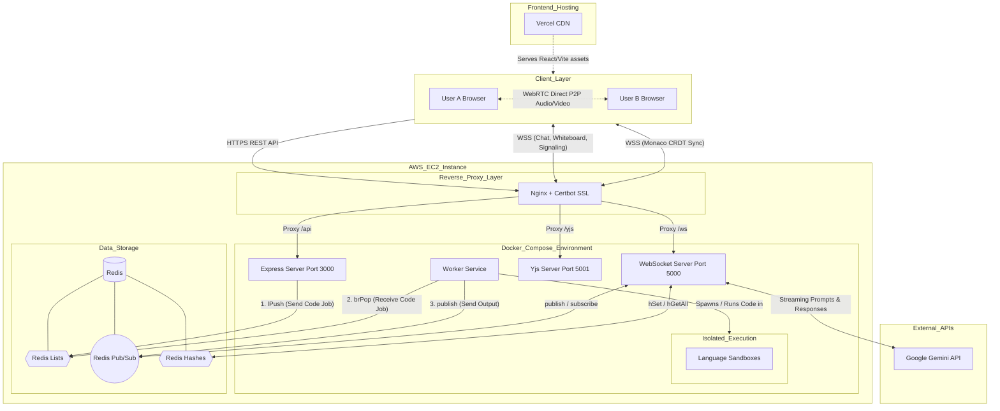
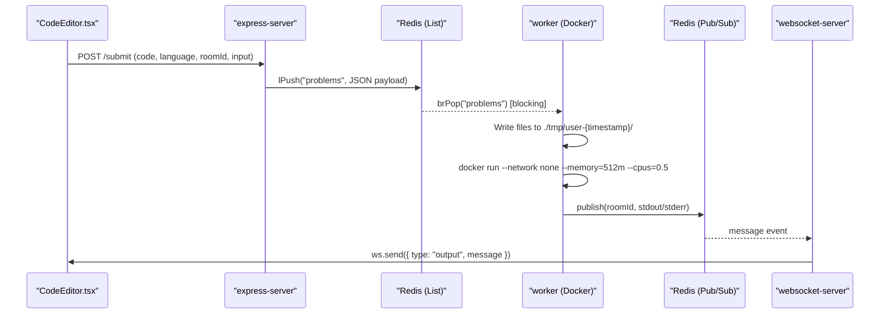
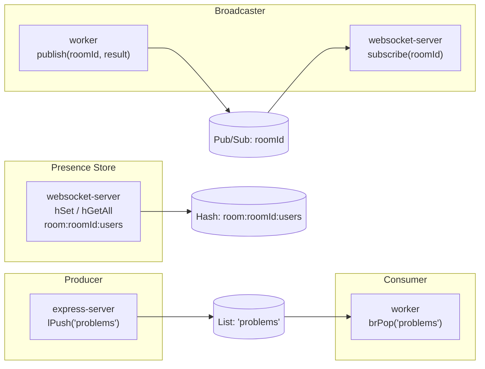
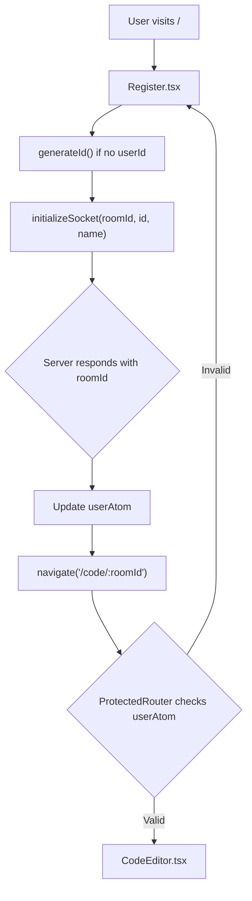
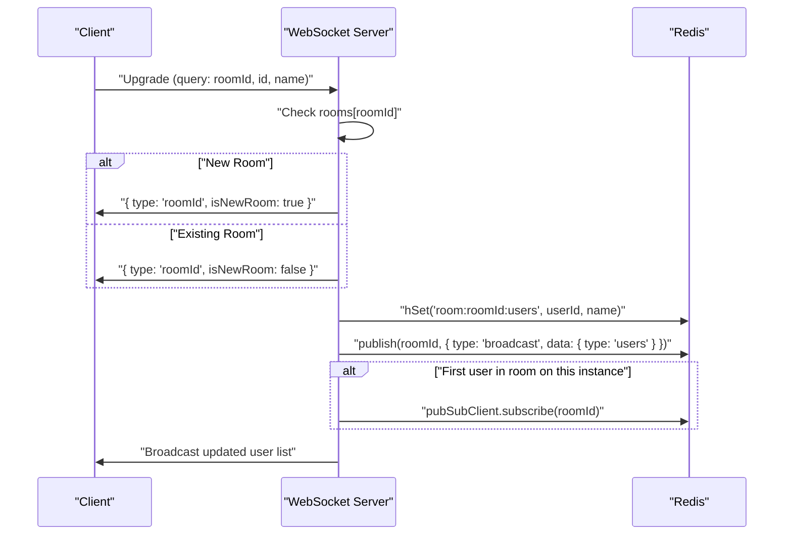
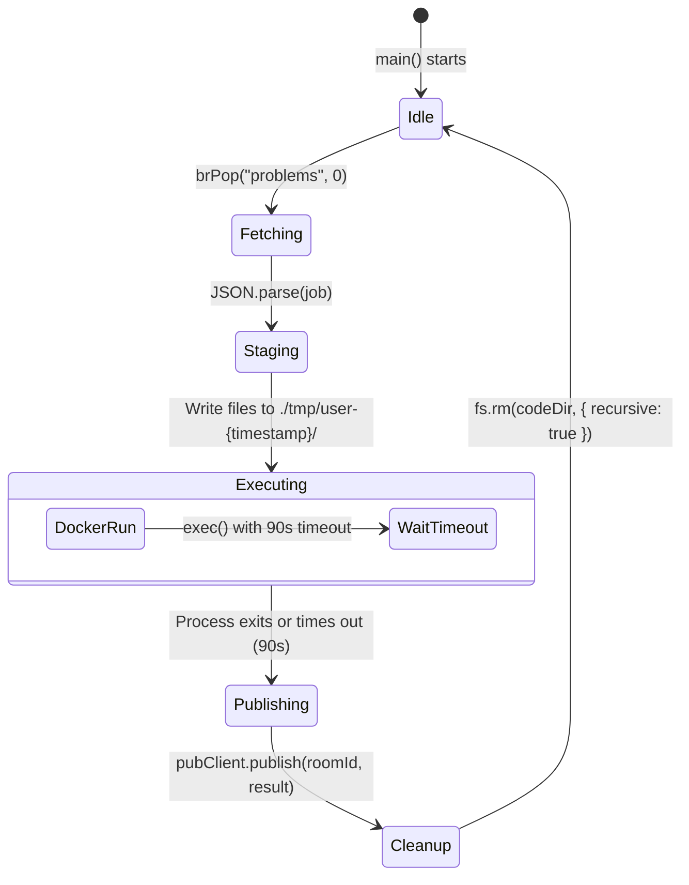
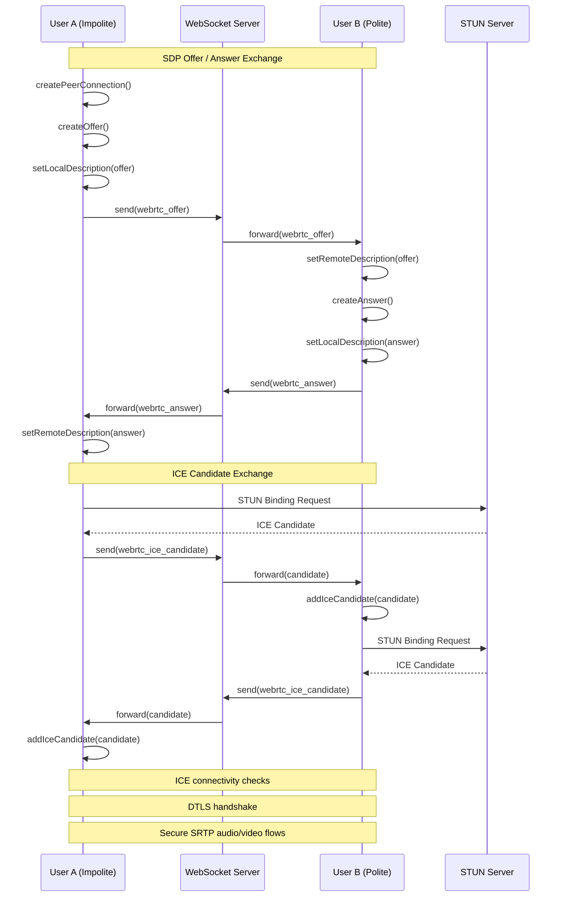
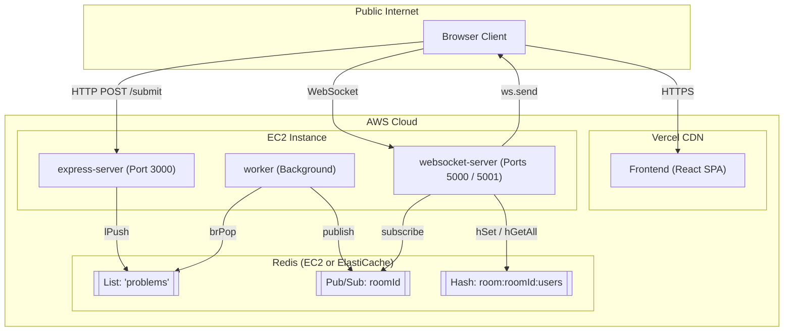
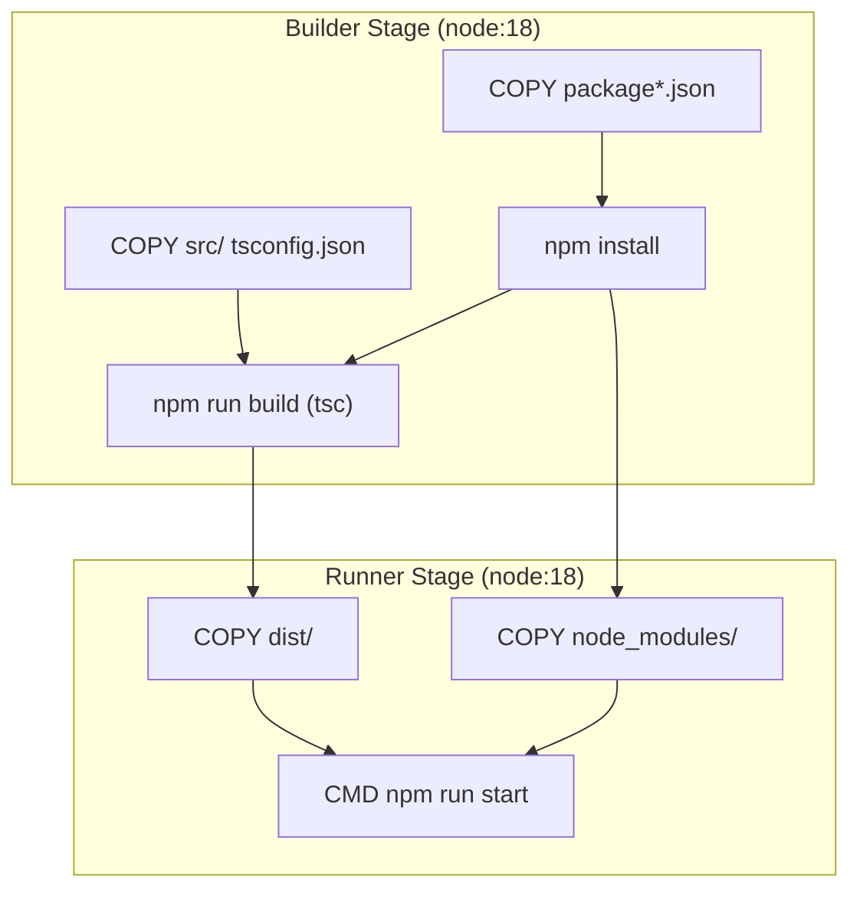

# SyncForge


> **SyncForge** is a real-time collaborative coding platform featuring a multi-language code editor, interactive whiteboard, WebRTC-based audio/video chat, and integrated AI pair programming.

**Live Demo:** [https://sync-code-express-server.vercel.app/](https://sync-code-express-server.vercel.app/)


| Code Editor | Whiteboard |
| :---------: | :--------: |
|  |  |

---

|  |  |  |
| :--: | :--------: | :----: |
|  |  |  |

---

### Cloud IDE Architecture


### Collaborative Code Editor Architecture


---

## Table of Contents

- [Features](#features)
- [Tech Stack](#tech-stack)
- [Architecture Overview](#architecture-overview)
  - [High-Level Service Topology](#high-level-service-topology)
  - [Component Breakdown](#component-breakdown)
  - [Code Execution Pipeline](#code-execution-pipeline)
  - [Dual WebSocket Strategy](#dual-websocket-strategy)
  - [Redis Architecture](#redis-architecture)
- [Monorepo Structure](#monorepo-structure)
  - [Turborepo Task Pipeline](#turborepo-task-pipeline)
  - [Root Scripts](#root-scripts)
- [Services](#services)
  - [Frontend — `apps/frontend`](#frontend--appsfrontend)
  - [Express Server — `apps/express-server`](#express-server--appsexpress-server)
  - [WebSocket Server — `apps/websocket-server`](#websocket-server--appswebsocket-server)
  - [Worker — `apps/worker`](#worker--appsworker)
- [Real-Time Collaboration Features](#real-time-collaboration-features)
  - [CRDT-Based Code Sync](#crdt-based-code-sync)
  - [WebRTC Audio/Video](#webrtc-audiovideo)
  - [Collaborative Whiteboard](#collaborative-whiteboard)
  - [Chat & AI Integration](#chat--ai-integration)
- [Infrastructure & Deployment](#infrastructure--deployment)
  - [AWS Deployment Topology](#aws-deployment-topology)
  - [Docker Configuration](#docker-configuration)
  - [Part 1 — Deploying Backend on AWS EC2](#part-1--deploying-backend-on-aws-ec2)
  - [Part 2 — Deploying Frontend on Vercel](#part-2--deploying-frontend-on-vercel)
- [Environment Variables](#environment-variables)
- [Getting Started](#getting-started)
  - [Prerequisites](#prerequisites)
  - [Installation](#installation)
  - [Development](#development)
  - [Build](#build)
- [Supported Languages](#supported-languages)
- [Security Model](#security-model)
- [Glossary](#glossary)

---

## Features

- **Real-time collaborative code editing** using Yjs CRDTs and Monaco Editor
- **Multi-language code execution** (JavaScript, Python, C++, Go) in Docker sandboxes
- **WebRTC mesh audio/video** calling with Perfect Negotiation
- **Collaborative whiteboard** with dual-canvas architecture and remote cursor tracking
- **AI Pair Programmer** powered by Google Gemini (`gemini-2.5-flash-lite`) with streaming responses
- **Integrated chat** with image sharing and Markdown rendering
- **Distributed presence** tracking via Redis Hashes
- **Horizontally scalable** backend via Redis Pub/Sub
- **Session-protected routing** with Recoil-based global state

---

## Tech Stack

| Layer | Technology |
|---|---|
| **Frontend** | React, Vite, TypeScript, Monaco Editor, Yjs, y-monaco, Recoil, Tailwind CSS, Framer Motion, shadcn/ui, Radix UI |
| **Signaling Server** | Node.js, TypeScript, `ws`, y-websocket, Google Generative AI SDK |
| **API Server** | Node.js, Express.js, TypeScript |
| **Worker** | Node.js, TypeScript, Docker CLI (`child_process`) |
| **Message Broker** | Redis (List, Pub/Sub, Hash) |
| **Monorepo Tooling** | Turborepo, npm workspaces, Prettier |
| **Containerization** | Docker (multi-stage builds) |
| **Deployment** | Vercel (Frontend), AWS EC2 (WebSocket Server + Express Server + Worker) |

---

## Architecture Overview

### High-Level Service Topology

The system is composed of four independent services communicating via HTTP, WebSockets, and Redis.



---

### Component Breakdown

1. **Client Layer** — A React frontend using Vite, heavily relying on Monaco Editor for code input, Yjs for CRDT-based operational transformations (real-time typing sync), and native WebRTC APIs for peer-to-peer mesh video calling.
2. **Nginx Reverse Proxy** — Acts as the single entry point to the AWS backend. Terminates SSL (from Certbot) and routes traffic via URL paths (`/api`, `/ws`, `/yjs`) to the isolated Docker containers.
3. **Backend Services (Node.js)**:
   - **Express** — Handles standard HTTP requests (auth, saving state, triggering code execution).
   - **WebSocket (Port 5000)** — A custom `ws` implementation routing WebRTC signaling (offers/answers/ICE), chat messages, whiteboard coordinates, and AI streaming via the Gemini API.
   - **Yjs Server (Port 5001)** — The standard `y-websocket` server dedicated exclusively to keeping the Monaco Editor document synced across clients.
   - **Worker** — A detached background service that consumes and executes code jobs from the Redis queue.
4. **Data Layer (Redis)** — The central nervous system of the backend, utilized for Pub/Sub messaging, presence tracking (Hashes), and a persistent job queue (Lists) to offload heavy code-execution tasks.

---

### Code Execution Pipeline

The most critical data flow is the lifecycle of a code submission — from user action to sandboxed execution and back.



**Step-by-step:**

1. **Submission** — `CodeEditor.tsx` sends `POST /submit` with `{ code, language, roomId, input }`.
2. **ID Generation** — Express generates `submissionId = "submission-" + Date.now() + "-" + roomId`.
3. **Queuing** — Express calls `redisClient.lPush("problems", JSON.stringify(payload))`.
4. **Consumption** — Worker blocks on `client.brPop("problems", 0)` until a job arrives.
5. **Staging** — Worker writes `userCode.<ext>` and `input.txt` to a `./tmp/user-{timestamp}/` directory.
6. **Execution** — Worker spawns a Docker container with a 90-second timeout.
7. **Result** — Worker publishes `stdout`/`stderr` to Redis channel `roomId`.
8. **Relay** — WebSocket server receives the Pub/Sub message and calls `ws.send()` to all clients in the room.

---

### Dual WebSocket Strategy

SyncForge separates real-time traffic across two WebSocket connections:

| Port | Purpose | Technology | Handles |
|---|---|---|---|
| **5000** | Signaling | Custom `ws` server | Room management, WebRTC offers/answers/ICE, chat, whiteboard strokes, execution output, AI streaming |
| **5001** | CRDT Sync | `y-websocket` | Binary Yjs protocol for conflict-free code editor synchronization |

This separation ensures that heavy binary CRDT traffic does not interfere with low-latency application signaling.

---

### Redis Architecture

Redis serves three distinct roles as the central nervous system of the backend:



| Role | Redis Primitive | Key | Used By |
|---|---|---|---|
| **Job Queue** | `List` | `problems` | Express (`lPush`), Worker (`brPop`) |
| **Message Bus** | `Pub/Sub` | `{roomId}` | Worker (`publish`), WebSocket Server (`subscribe`) |
| **Presence Store** | `Hash` | `room:{roomId}:users` | WebSocket Server (`hSet`, `hGetAll`) |

**First-In-Subscribes Optimization:** The WebSocket server only calls `pubSubClient.subscribe(roomId)` when the first user joins a room on that instance (`rooms[roomId].length === 1`). All subsequent users in the same room share the single subscription.

---

## Monorepo Structure

The project is managed as a **Turborepo** monorepo with **npm workspaces**.

```
SyncForge/
├── apps/
│   ├── frontend/          # React/Vite SPA
│   ├── express-server/    # REST API (code submission)
│   ├── websocket-server/  # Signaling + CRDT sync server
│   └── worker/            # Docker-based code execution engine
├── packages/              # Shared configs and utilities
├── package.json           # Root workspace definition
└── turbo.json             # Turborepo task pipeline
```

### Turborepo Task Pipeline

Defined in `turbo.json`:

| Task | Behavior | Cache |
|---|---|---|
| `build` | Compiles TypeScript; outputs to `dist/**` | Yes |
| `check-types` | TypeScript validation; respects dependency order (`^check-types`) | Yes |
| `dev` | Starts all services in watch mode | No (persistent) |

### Root Scripts

```bash
npm run build    # turbo build — build all apps
npm run dev      # turbo dev — start all apps in dev mode
npm run lint     # turbo lint — lint entire monorepo
npm run format   # prettier --write "**/*.{ts,tsx,md}"
```

**Requirements:** Node.js >= 18, npm >= 10.8.1

---

## Services

### Frontend — `apps/frontend`

The primary user interface — a high-performance collaborative IDE built with React and Vite.

**Key Dependencies:**

| Package | Purpose |
|---|---|
| `@monaco-editor/react` | VS Code-grade code editor |
| `yjs` + `y-monaco` + `y-websocket` | CRDT-based real-time text sync |
| `recoil` | Global state management |
| `react-router-dom` | Client-side routing |
| `tailwindcss` + `framer-motion` | Styling and animations |
| `@radix-ui/*` + `class-variance-authority` | Accessible UI primitives (shadcn/ui) |

**Routing:**

| Route | Component | Description |
|---|---|---|
| `/` | `Register` | Landing page — create a new room |
| `/:roomId` | `Register` | Join an existing room via invite link |
| `/code/:roomId` | `CodeEditor` (via `ProtectedRouter`) | Main collaborative workspace |

**Global State (Recoil Atoms):**

| Atom | Type | Purpose |
|---|---|---|
| `userAtom` | `{ id, name, roomId }` | Current user identity and room assignment |
| `socketAtom` | `WebSocket \| null` | Active signaling WebSocket instance |
| `connectedUsersAtom` | `User[]` | List of users currently in the room |

**Session Flow:**



---

### Express Server — `apps/express-server`

A stateless REST API that acts as the producer in the code execution pipeline.

**Endpoint:**

```
POST /submit
Content-Type: application/json

{
  "code": "console.log('hello')",
  "language": "js",
  "roomId": "abc123",
  "input": ""
}
```

**Response:**
- `200 OK` — `"Submission received and stored"`
- `500 Internal Server Error` — `"Failed to store submission"`

**Configuration:**

| Variable | Default | Description |
|---|---|---|
| `PORT` | `3000` | Server listen port |
| `REDIS_URL` | — | Redis connection string |

**Middleware:** `express.json()`, `cors()`  
**Binding:** `0.0.0.0` (accessible internally and externally)

---

### WebSocket Server — `apps/websocket-server`

The real-time backbone of SyncForge. Manages room lifecycle, message routing, Redis Pub/Sub relay, and AI streaming.

**Ports:**
- `5000` — Custom signaling server (`ws`)
- `5001` — Yjs CRDT sync server (`y-websocket` / `setupWSConnection`)

**Connection Lifecycle:**



**Message Types (handled by `requestRouter`):**

| Type | Delivery | Description |
|---|---|---|
| `requestToGetUsers` | Broadcast | Fetch all active users from Redis Hash |
| `requestForAllData` | Direct | New joiner requests full editor state from a peer |
| `allData` | Direct | Response with full environment snapshot |
| `code` / `input` / `language` | Broadcast | Sync editor content, stdin, and language selection |
| `submitBtnStatus` | Broadcast | Sync "Run" button loading state across all users |
| `cursorPosition` | Broadcast | Real-time remote cursor tracking in editor |
| `webrtc_offer` / `webrtc_answer` / `webrtc_ice_candidate` | Direct | WebRTC SDP and ICE relay for P2P audio/video |
| `chat_message` | Broadcast | Text and image messages in chat panel |
| `whiteboard_stroke` / `whiteboard_clear` | Broadcast | Canvas drawing paths and clear events |
| `whiteboard_cursor` | Broadcast | Remote mouse positions on whiteboard |
| `ask_ai` | Streaming | Triggers Gemini AI streaming response |

**Environment Variables:**

| Variable | Description |
|---|---|
| `REDIS_URL` | Redis connection string |
| `GEMINI_API_KEY` | Google Generative AI API key |

---

### Worker — `apps/worker`

A background service that consumes code execution jobs from Redis and runs them in ephemeral Docker containers.

**Execution Lifecycle:**



**Supported Languages & Docker Images:**

| Language | Docker Image | Execution |
|---|---|---|
| JavaScript | `node:18-alpine` | `node userCode.js input.txt` |
| Python | `python:3.9-alpine` | `python userCode.py input.txt` |
| C++ | `gcc:latest` | `sh -c "g++ userCode.cpp -o a.out && ./a.out < input.txt"` |
| Go | `golang:1.20-alpine` | `sh -c "go run userCode.go < input.txt"` |

**Security Constraints per Execution Container:**

| Constraint | Value | Purpose |
|---|---|---|
| `--network none` | Disabled | Prevent data exfiltration / external access |
| `--memory` | `512m` | Prevent OOM attacks on host |
| `--cpus` | `0.5` | Prevent infinite loops from consuming host CPU |
| `--rm` | Auto-remove | Clean up container filesystem after execution |
| `timeout` | `90000ms` | Kill process if it exceeds 90 seconds |

**Environment Variables:**

| Variable | Description |
|---|---|
| `REDIS_URL` | Redis connection string |

---

## Real-Time Collaboration Features

### CRDT-Based Code Sync

When the Monaco editor mounts (`handleEditorDidMount`):

1. A new `Y.Doc` is created to hold shared document state.
2. A `WebsocketProvider` connects to the Yjs sync server (port 5001) using `roomId` as the namespace.
3. `MonacoBinding` bridges the `Y.Text` shared type to the Monaco editor instance, enabling conflict-free multi-user editing with remote cursor visualization.

**State Synchronization Layers:**

| Layer | Mechanism | Manages |
|---|---|---|
| Document Content | Yjs CRDT | Code text, remote cursors |
| Environment State | WebSocket JSON (port 5000) | Language, input/output, button status, user presence |
| Ephemeral UI | React state / Recoil | Active tab, view mode (editor vs. whiteboard) |

**"Request For All Data" Pattern** — When a new user joins, they send `requestForAllData`. An existing peer responds with an `allData` payload containing the current `language`, `input`, `output`, and `isLoading` states, ensuring the new user is immediately in sync.

**Local Persistence** — Code and input are saved to `localStorage` on state change to prevent data loss on accidental page refresh.

---

### WebRTC Audio/Video

Implemented in the `useWebRTC` hook with a **mesh topology** — every user maintains a direct `RTCPeerConnection` with every other user.



> **Note on roles:** The "polite" peer is whichever user has the **lexicographically greater** `userId` string compared to the remote peer (`userId > senderId`). Roles are not fixed — they depend on runtime userId values.

- **Perfect Negotiation** — Glare (simultaneous offers) is resolved by assigning a "polite" role. The peer whose `userId` string is **lexicographically greater** than the sender's is polite. The polite peer rolls back its own offer on collision.
- **ICE** — Uses two Google public STUN servers (`stun.l.google.com:19302`, `stun1.l.google.com:19302`) for NAT traversal.
- **Track Management** — When `localStream` changes (camera/mic toggle), all active peer connections are updated via `pc.addTrack` / `pc.removeTrack`.

---

### Collaborative Whiteboard

A shared drawing surface using a **dual-canvas architecture**:

| Canvas | Role |
|---|---|
| `canvasRef` (Main) | Holds permanent, committed drawing state shared by all users |
| `overlayRef` (Overlay) | Renders the active local stroke in real-time before committing |

- **Stroke Broadcasting** — On `pointerUp`, the `Stroke` object (points, tool, author) is sent via `whiteboard_stroke` WebSocket message.
- **Remote Cursors** — Tracked and rendered for all participants; throttled to one update per 50ms to prevent WebSocket congestion.
- **Smooth Rendering** — Uses `quadraticCurveTo` for smooth path rendering.
- **Auto-Save** — Whiteboard state is saved to `localStorage` as a DataURL via `triggerAutoSave`.
- **User Colors** — `getUserColor()` deterministically assigns a color per username.

---

### Chat & AI Integration

- **Message Schema** — `ChatMessage { senderId, timestamp, imageUrl?, isAi? }`
- **Image Compression** — Images are resized to max 800px and converted to JPEG at 0.6 quality using a hidden canvas before sending, minimizing WebSocket payload size.
- **Markdown Rendering** — Messages are rendered with `ReactMarkdown` for rich formatting and syntax-highlighted code blocks.
- **AI Streaming** — The `ask_ai` message triggers the Gemini handler on the WebSocket server. Each text chunk is published as `chat_ai_chunk` to Redis, relayed to the frontend, and appended to the last AI message in real-time, creating a typing effect.
- **AI Model** — `gemini-2.5-flash-lite` via `@google/generative-ai` SDK.
- **Context-Aware** — The editor's right-click context menu exposes three AI actions: **"Explain this logic"**, **"Find Bugs"**, and **"Optimize Code"**. Each captures the highlighted selection and current language, sending them to Gemini as context.

---

## Infrastructure & Deployment

### AWS Deployment Topology



| Service | Host | Port(s) | Notes |
|---|---|---|---|
| Frontend | Vercel | 443 (HTTPS) | Global CDN delivery |
| Express Server | AWS EC2 | 3000 | Stateless REST API |
| Worker | AWS EC2 | N/A | Background job processor |
| WebSocket Server | AWS EC2 | 5000, 5001 | Stateful; long-lived connections |
| Redis | AWS EC2 / ElastiCache | 6379 | Shared pub/sub, queue & presence |

EC2 is used for all backend services to support persistent, long-lived WebSocket connections and shared Docker access for code sandboxing.

---

### Docker Configuration

All backend services are containerized using **multi-stage Dockerfiles**.

**Express Server & WebSocket Server (Multi-Stage):**



**Worker (Specialized Image):**

The Worker image is built on `node:18`. Unlike the other services, it does **not** pre-install language runtimes. Instead, it pulls Docker images on-demand at runtime (`node:18-alpine`, `python:3.9-alpine`, `gcc:latest`, `golang:1.20-alpine`) using the host Docker socket. It also creates a non-root user `myuser` and transfers ownership of `/usr/src/app` to it before startup, providing defense-in-depth against privilege escalation.

**Docker Compose (all backend services together):**

```yaml
version: '3.8'

services:
  redis:
    image: redis:alpine
    ports:
      - "6379:6379"

  express-server:
    build:
      context: ./apps/express-server
    ports:
      - "3000:3000"
    environment:
      - REDIS_URL=redis://redis:6379
      - PORT=3000
    depends_on:
      - redis

  websocket-server:
    build:
      context: ./apps/websocket-server
    ports:
      - "5000:5000"
      - "5001:5001"
    environment:
      - REDIS_URL=redis://redis:6379
      - GEMINI_API_KEY=your_google_gemini_api_key
      - PORT=5000
    depends_on:
      - redis

  worker:
    build:
      context: ./apps/worker
    environment:
      - REDIS_URL=redis://redis:6379
    depends_on:
      - redis
```

---

### Part 1 — Deploying Backend on AWS EC2

#### Step 1.1 — Launch an AWS EC2 Instance

1. Log in to the [AWS Management Console](https://console.aws.amazon.com/).
2. Navigate to **EC2** → **Instances** → **Launch instances**.
3. **Name**: `sync-code-backend`
4. **AMI**: Ubuntu Server 24.04 LTS (or 22.04 LTS)
5. **Instance Type**: `t3.micro` (free tier) or `t3.small` (recommended to avoid memory issues during builds)
6. **Key Pair**: Create or select an existing key pair (e.g., `sync-key.pem`)
7. **Network Settings**: Allow SSH, HTTP, and HTTPS traffic
8. Click **Launch instance**

#### Step 1.2 — Connect & Install Docker

```bash
# Set permissions on your key file
chmod 400 sync-key.pem

# SSH into the instance
ssh -i "sync-key.pem" ubuntu@<EC2_PUBLIC_IP>

# Install Docker and Docker Compose
sudo apt update
sudo apt install docker.io docker-compose -y
sudo systemctl enable docker
sudo systemctl start docker
sudo usermod -aG docker $USER
```

> **Note:** Disconnect and reconnect (`exit` and re-SSH) for the `docker` group changes to take effect.

#### Step 1.3 — Clone the Repo & Configure Services

```bash
git clone https://github.com/harshitzofficial/SyncForge.git sync-code
cd sync-code
```

Create a `docker-compose.yml` at the project root using the template in the [Docker Compose section above](#docker-configuration). Add your `GEMINI_API_KEY` and any other secrets to the `environment` blocks.

#### Step 1.4 — Build & Run the Backend

```bash
# Build images and start all services in detached mode
docker-compose up -d --build

# Verify all containers are running
docker-compose ps
```

You should see `redis`, `express-server`, `websocket-server`, and `worker` all in the **Up** state.

#### Step 1.5 — Open Required Ports in AWS Security Group

Navigate to your EC2 instance → **Security** tab → click the Security Group → **Edit Inbound Rules**, and add:

| Port | Protocol | Source | Purpose |
|---|---|---|---|
| `3000` | Custom TCP | `0.0.0.0/0` | Express REST API |
| `5000` | Custom TCP | `0.0.0.0/0` | WebSocket signaling |
| `5001` | Custom TCP | `0.0.0.0/0` | Yjs CRDT sync |

> **Tip:** For production, set up an **Nginx reverse proxy + Certbot** to route traffic through ports 80/443 with SSL/TLS, serving the backend over `https://` and `wss://` instead of exposing raw ports.

---

### Part 2 — Deploying Frontend on Vercel

#### Step 2.1 — Set Production Environment Variables

In `apps/frontend/.env.production`, point all URLs to your EC2 instance:

```env
VITE_PRIMARY_BACKEND_URL=http://<EC2_PUBLIC_IP>:3000
VITE_WS_URL=ws://<EC2_PUBLIC_IP>:5000
VITE_YJS_WEBSOCKET_URL=ws://<EC2_PUBLIC_IP>:5001
```

#### Step 2.2 — Deploy via Vercel Dashboard

1. Log in to [Vercel](https://vercel.com/) → **Add New** → **Project**
2. Import your GitHub repository
3. Vercel auto-detects **Turborepo** — configure build settings:
   - **Root Directory**: `apps/frontend`
   - **Framework Preset**: Vite
   - **Build Command**: `npm run build` or `turbo run build --filter=frontend`
   - **Output Directory**: `dist`
4. Add environment variables from Step 2.1 in the **Environment Variables** section
5. Click **Deploy**

> [!IMPORTANT]
> If the frontend (HTTPS on Vercel) throws **mixed-content errors** when connecting to HTTP backend endpoints, you **must** configure SSL/TLS on your EC2 instance (Nginx + Certbot) so the backend is reachable via `https://` and `wss://`.

#### Step 2.3 — Verify Deployment

1. Click **Visit** after the Vercel build completes.
2. Open **DevTools → Network tab** and confirm:
   - `POST /submit` reaches your EC2 Express API
   - WebSocket connection establishes to your EC2 WebSocket server

---

## Environment Variables

### `apps/frontend`

```env
VITE_PRIMARY_BACKEND_URL=http://localhost:3000
VITE_WEBSOCKET_SERVER_URL=ws://localhost:5000
VITE_YJS_WEBSOCKET_URL=ws://localhost:5001
```

### `apps/express-server`

```env
PORT=3000
REDIS_URL=redis://localhost:6379
```

### `apps/websocket-server`

```env
REDIS_URL=redis://localhost:6379
GEMINI_API_KEY=your_google_gemini_api_key
```

### `apps/worker`

```env
REDIS_URL=redis://localhost:6379
```

---

## Getting Started

### Prerequisites

- Node.js >= 18
- npm >= 10.8.1
- Docker (running, for the Worker service)
- Redis instance (local or remote)

### Installation

```bash
# Clone the repository
git clone https://github.com/harshitzofficial/SyncForge.git
cd SyncForge

# Install all dependencies across all workspaces
npm install
```

### Development

Create `.env` files in each service directory (use the included `.env.example` files as templates), start Redis, then:

```bash
# Start local Redis once
docker run -d --name syncforge-redis -p 6379:6379 redis:7

# Start all services in parallel (Turborepo)
npm run dev
```

This starts:
- `apps/frontend` — Vite dev server
- `apps/express-server` — Express API
- `apps/websocket-server` — WebSocket signaling + Yjs sync
- `apps/worker` — Redis job consumer

### Build

```bash
npm run build
```

Compiles all TypeScript services to `dist/` and builds the frontend to `dist/assets/`.

---

## Supported Languages

| Language | File | Docker Image |
|---|---|---|
| JavaScript | `userCode.js` | `node:18-alpine` |
| Python | `userCode.py` | `python:3.9-alpine` |
| C++ | `userCode.cpp` | `gcc:latest` |
| Go | `userCode.go` | `golang:1.20-alpine` |

Monaco Editor is also enhanced with custom code snippets for JavaScript, Python, C++, Java, Rust, and Go (e.g., `forloop`, `main`, print statements) via `registerMonacoSnippets`.

---

## Security Model

| Threat | Mitigation |
|---|---|
| Network access from user code | `--network none` on execution containers |
| Memory exhaustion (OOM) | `--memory="512m"` per container |
| CPU exhaustion (infinite loops) | `--cpus="0.5"` per container |
| Long-running processes | 90-second `exec` timeout |
| Container filesystem persistence | `--rm` flag auto-removes containers |
| Disk exhaustion | `fs.rm(codeDir, { recursive: true })` after every execution |
| Privilege escalation in Worker | Worker runs as non-root `myuser` |
| Build-time dependency leakage | Multi-stage Docker builds exclude `devDependencies` from runner images |

---

## Glossary

| Term | Definition |
|---|---|
| **CRDT** | Conflict-free Replicated Data Type — a data structure allowing concurrent updates that always converge. Used via `Yjs` for the code editor. |
| **Dual WebSocket Strategy** | Running two WebSocket servers (port 5000 for signaling, port 5001 for Yjs CRDT sync) to separate concerns. |
| **Perfect Negotiation** | A WebRTC pattern to resolve simultaneous offer collisions. The "polite" peer (higher `userId`) rolls back its offer on glare. |
| **brPop** | Redis blocking pop — the Worker uses this to wait indefinitely for new jobs in the `problems` list without busy-waiting. |
| **Sandboxing** | Running user code inside ephemeral Docker containers with `--network none` and strict resource limits. |
| **Recoil Atoms** | Units of global state in the React frontend (`userAtom`, `socketAtom`, `connectedUsersAtom`). |
| **Monaco Editor** | The VS Code editor engine embedded in the frontend for the code workspace. |
| **Turborepo** | Monorepo build orchestration tool that runs tasks across all workspaces in parallel with caching. |
| **`problems` list** | The Redis List key used as the FIFO job queue between the Express server (producer) and Worker (consumer). |
| **`room:{roomId}:users`** | Redis Hash key storing `userId → name` mappings for distributed presence tracking. |
| **Gemini AI** | Google's `gemini-2.5-flash-lite` model used as the AI Pair Programmer, accessed via `@google/generative-ai`. |

---

[](https://deepwiki.com/harshitzofficial/SyncForge)
