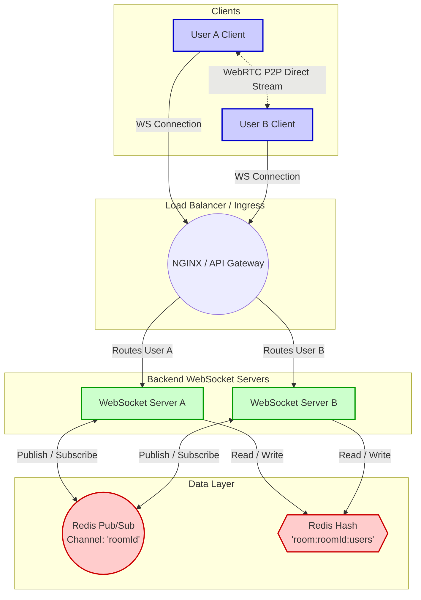

# WebRTC & Multi-Server WebSocket Architecture

The following diagrams illustrate how the application handles multi-server WebRTC signaling and data synchronization using Redis.

## 1. System Topology

This diagram shows the physical layout of the connections. Notice how the WebSocket servers are isolated from each other, but communicate via the central Redis instance. Once signaling is complete, the clients talk directly to each other via WebRTC.



## 2. Signaling Sequence Flow

This sequence diagram outlines the exact flow of events over time when User A and User B connect and initiate a WebRTC call across different servers.

```mermaid
sequenceDiagram
    participant UA as User A (Browser)
    participant SA as Server A (WS)
    participant R as Redis Pub/Sub
    participant SB as Server B (WS)
    participant UB as User B (Browser)

    Note over UA, UB: 1. Initial WebSocket Connection & Setup
    UA->>SA: Connects via WS (Room 123)
    SA->>R: hSet room:123:users UserA
    SA->>R: SUBSCRIBE room:123
    
    UB->>SB: Connects via WS (Room 123)
    SB->>R: hSet room:123:users UserB
    SB->>R: SUBSCRIBE room:123
    
    Note over UA, UB: 2. WebRTC Signaling (Offers/Answers/ICE)
    
    UA->>SA: Send WebRTC Offer (Target: User B)
    SA->>R: PUBLISH room:123 (direct message for User B)
    R-->>SB: Deliver Message to Subscriber
    SB->>UB: Forward WebRTC Offer
    
    UB->>SB: Send WebRTC Answer (Target: User A)
    SB->>R: PUBLISH room:123 (direct message for User A)
    R-->>SA: Deliver Message to Subscriber
    SA->>UA: Forward WebRTC Answer
    
    Note over UA, UB: ICE Candidates are exchanged identically to the Offer/Answer above
    
    Note over UA, UB: 3. WebRTC Peer-to-Peer Established
    UA<-->>UB: Direct WebRTC Audio/Video/Data Stream
    Note over UA, UB: (WebRTC Traffic now bypasses Node & Redis completely)
```

> [!NOTE]
> **Why this matters for scale**: Because state is offloaded to Redis, you can spin up 100 Server instances behind a Load Balancer. As long as they all point to the same Redis instance, any two users in the same room can always find each other and establish a WebRTC connection.
