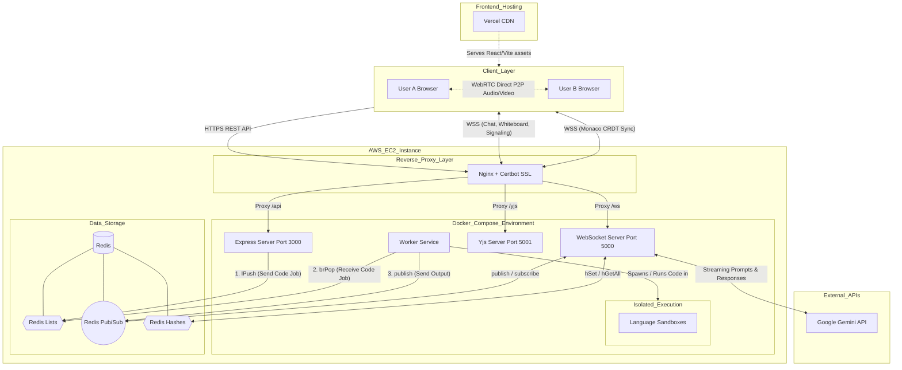

# High Level Design (HLD) - SyncForge

The following architectural diagram illustrates the complete system topology of the SyncForge project, demonstrating how the frontend, proxy layer, backend microservices, data layer, and external APIs interact.

## Complete Architecture Topology

## Component Breakdown

1. **Client Layer**: A React frontend using Vite, heavily relying on Monaco Editor for code input, Yjs for CRDT-based operational transformations (real-time typing sync), and native WebRTC APIs for peer-to-peer mesh video calling.
2. **Nginx Reverse Proxy**: Acts as the single entry point to the AWS backend. Terminated SSL (from Certbot) and routes traffic via URL paths (`/api`, `/ws`, `/yjs`) to the isolated Docker containers.
3. **Backend Services (Node.js)**:
   - **Express**: Handles standard HTTP requests (auth, saving state, triggering code execution).
   - **WebSocket (Port 5000)**: A custom WS implementation routing WebRTC signaling (offers/answers/ICE), chat messages, Whiteboard coordinates, and acting as a proxy to the Gemini AI API.
   - **Yjs Server (Port 5001)**: The standard `y-websocket` server dedicated exclusively to keeping the Monaco Editor document synced across clients.
   - **Worker**: A detached background service.
4. **Data Layer (Redis)**: The central nervous system of the backend, utilized for Pub/Sub messaging, presence tracking (Hashes), and a persistent job queue (Lists) to offload heavy code-execution tasks.
